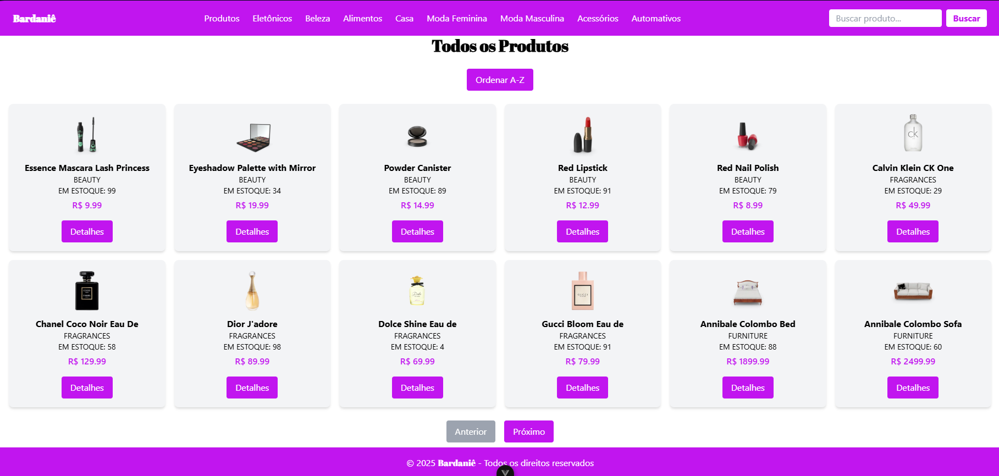
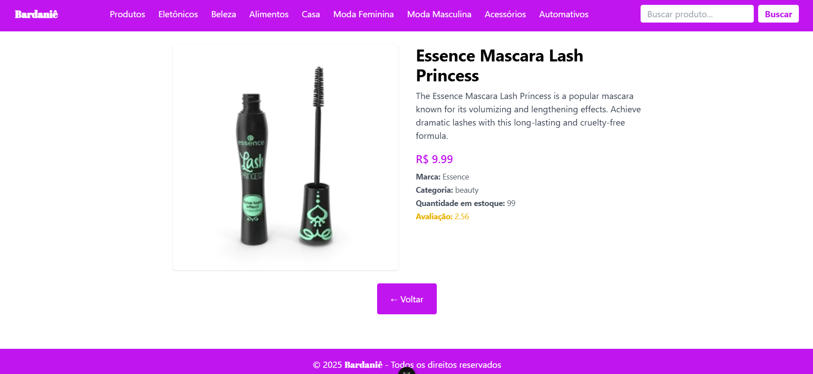
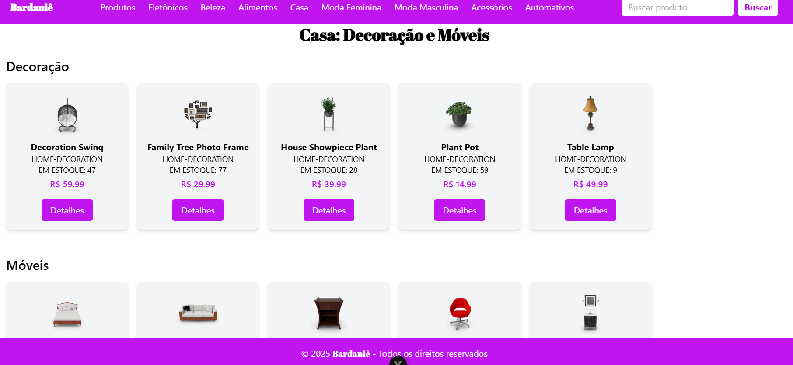
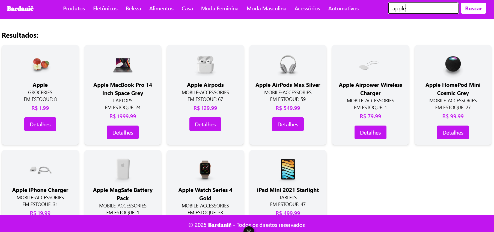

# E-commerce com a API Dummy Json

Bardaniê, é um E-commerce de uma grande variedade de produtos como, Eletronicos, Beleza, Alimentos, Casa, Moda Feminina e Masculina tudo isso utilizando a API DummyJSON.    
A página inicial faz uma listagem de todos os produtos da API, mostrando nos cards o nome, a categoria quantidade em estoque e valor, e abaixo um botão para o usuário clicar e ver mais detalhes do produto, uma batão ao centro para organizar de A a Z os produtos e por fim é possível navegar entre os produtos indo e voltando entre as páginas.   

 

Após clicar no botão detalhes o usuário é redirecionado a outra tela que mostra mais informações como: Detalhes, marca e a avalição do produto selecionado, todas as informações são extraídas pelos IDs de cada item.  



No Navbar os produtos são separados em categorias, e o usuário pode escolher qual a melhor opção que ele procura no momento, há tambem uma barra de pesquisa para o usuario encontrar os produtos com mais agilidade.




## Como executar o sistema?

Clone o repositorio  
Primeiro, no terminal digite:
```
gh repo clone DanielebBorges/E-commerce
```

Acesse a pasta do e-commerce com:
```
Cd E-commerce
```  
Depois instale as dependências:
```
npm install
``` 
E por fim rode o projeto:
```
Npm run dev
``` 

## Video de Demonstração do projeto:    
 [Clique aqui para assistir](https://youtu.be/_lzfppw7CFg)

## Desenvolvido por:
Barbara Luani Rrebechi Santana e Daniele Barbosa Borges 